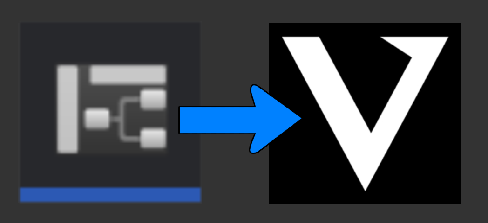
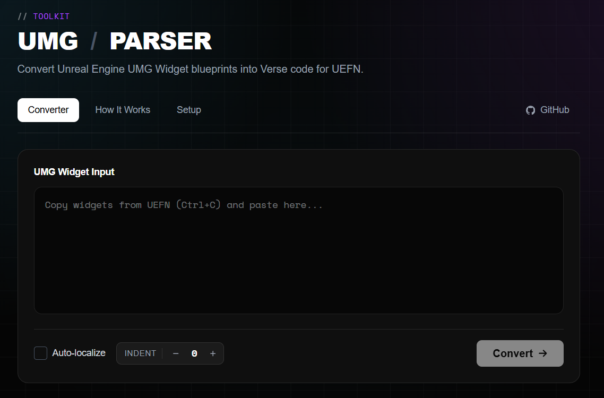

<!-- <div align="center"> -->

# UMG Parser


**Convert UMG Widget Blueprints to Verse UI code for Unreal Editor for Fortnite (UEFN)**

[](https://www.typescriptlang.org/)
[](https://opensource.org/licenses/MIT)
[](https://nodejs.org/)




<div align="center">

[**🚀 Try the Live Demo**](https://joojn.xyz/umg-parser)
</div>

## 📑 Table of Contents

- [Overview](#-overview)
- [Features](#-features)
- [Installation](#-installation)
- [Usage](#-usage)
- [Widget Naming Conventions](#-widget-naming-conventions)
- [Supported Widgets](#-supported-widgets)
- [License](#-license)

---

## 🎯 Overview

**UMG Parser** streamlines the process of converting Unreal Motion Graphics (UMG) Widget structures into Verse UI code. Whether you're handling basic layouts, dynamic variables, or external widgets, this tool helps you accelerate development in UEFN.

### Key Benefits

- ⚡ **Instant Conversion** — Copy from UEFN, paste, and get Verse code
- 🔄 **Auto File Replacement** — Automatically updates your Verse files
- 🌍 **Localization Support** — Generate translation message modules
- 📁 **Project Configs** — Per-project YAML configuration

---

## ✨ Features

| Feature | Description |
|---------|-------------|
| **Variable Widgets** | Prefix widget names with `$` to generate variables |
| **External References** | Reference widgets from other files using `$external_` prefix |
| **Font Override** | Apply custom fonts with `_FONT_` suffix in names |
| **Slider Workaround** | Use `PivotPoint` and `Shear` for slider properties |
| **Translation Keys** | Auto-generate localized messages module |
| **Auto Replace** | Replace code between markers in existing Verse files |

---

## 🚀 Installation

```bash
npm install umg-parser
```

---

## 📖 Usage

```typescript
import { UMGParser } from "umg-parser";

const parser = new UMGParser({
    useTranslated: false,
});

const umgText = "Begin Object Class=...  End Object";
const { code, exportPath, widgets } = parser.convert(umgText);

console.log(code);

// Optional: generate translation messages module
const messages = parser.generateMessagesModule(widgets);
```

---

## 🏷️ Widget Naming Conventions

Use special prefixes/suffixes in your widget's **Display Label** to control code generation:

### Variables (`$` prefix)

```plaintext
$RewardText
```

Creates a Verse variable:

```verse
RewardText := ...
```

### External References (`$external_` prefix)

```plaintext
$external_PlayerCard.Widget
```

References a widget defined elsewhere—useful for dynamic content.

### Ignored Widgets (`__ignore`)

```plaintext
Placeholder__ignore
```

Skips this widget during parsing (useful for placeholder/template widgets).

---

## 🎨 Supported Widgets

| Widget Type | Verse Equivalent | Notes |
|-------------|-----------------|-------|
| **Canvas Panel** | `canvas` | Root layout container |
| **Canvas Slot** | `canvas_slot` | Positioning within canvas |
| **Stack Box** | `stack_box` | Horizontal/vertical layouts |
| **Overlay** | `overlay` | Layered widgets |
| **Text Block** | `text_block` | Text display with styling |
| **Image** | `texture_block` | Image display |
| **Material Image** | `material_block` | Material-based images |
| **Color Block** | `color_block` | Solid color rectangles |
| **Button (Quiet)** | `button_quiet` | Minimal style button |
| **Button (Regular)** | `button_regular` | Standard button |
| **Button (Loud)** | `button_loud` | Emphasized button |
| **Slider** | `slider` | Value slider control |

### Slider Properties Workaround

Since UMG sliders can't directly specify Verse properties, use these UMG properties:

```
PivotPoint.X → MinValue
PivotPoint.Y → MaxValue
Shear.X     → DefaultValue (optional, defaults to MinValue)
Shear.Y     → Step (optional, defaults to 1)
```

---

## 📜 License

This project is licensed under the [MIT License](https://opensource.org/licenses/MIT).

---

<div align="center">

**Made with ❤️ for the UEFN community**

</div>
